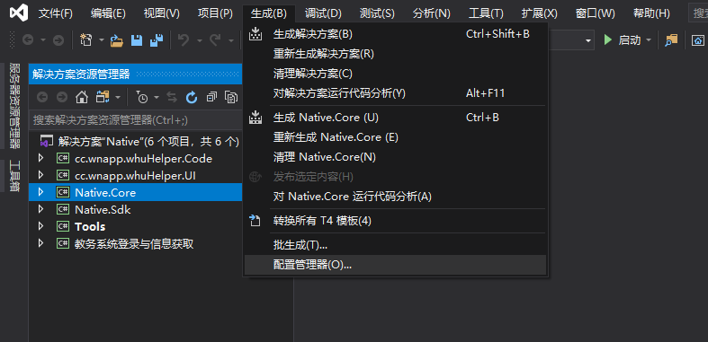
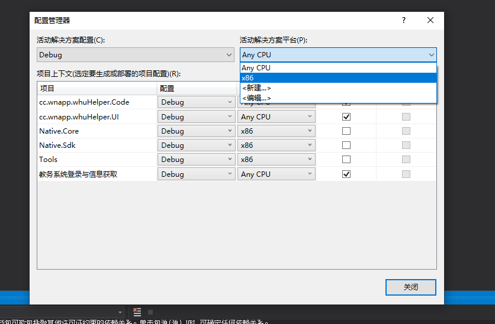
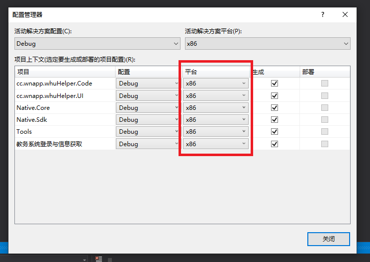
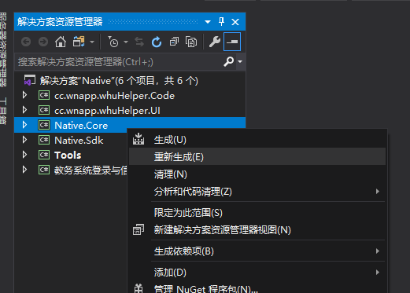
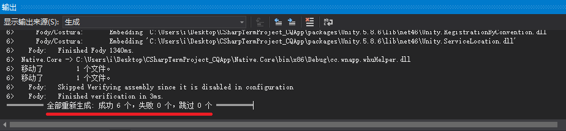
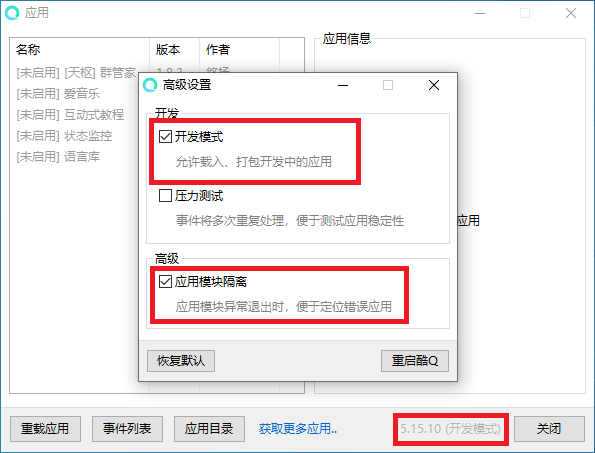
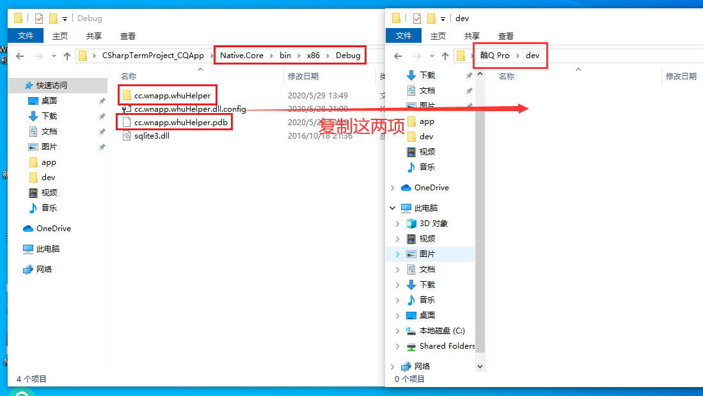
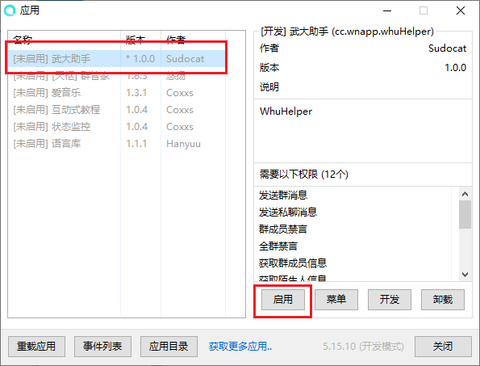

## 生成帮助
1. 首先确保您已达到系统环境要求。
2. Clone或Download代码至您本地的工作文件夹。
3. 打开解决方案。
4. 还原NuGet包：
   - 在解决方案资源管理器中找到 Native.Core 项目，右键，点击 管理NuGet程序包。
   - 如果看到 “此解决方案中缺少某些NuGet程序包。单击可从联机程序包源中还原。”的提示条，说明该项目中存在未安装的包，请点击还原按钮。
   - 确保所有包还原完成。
5. 准备编译：
   - 请确保所有第三方库和所引用的项目都在 Native.Core 中添加了引用，如果没有请自行添加引用。
   - 点击菜单“生成”，并打开配置管理器：  
   
   - 在活动解决方案平台中选择x86，如果没有请自行新建：  
   
   - 确保所有项目的平台均为x86，如不是请自行调整：  
   
6. 编译项目：
   - 右键 Native.Core 项目，点击 重新生成：  
   
   - 如果您没有在输出看到错误提示，则为生成成功：  
   
   - 如果看到了失败提示，请检查以上步骤是否全部重新完成，并遵循VS给出的错误信息进行调整。
7. 准备部署：
   - 打开酷Q机器人，登录（强烈建议使用小号而非自己的常用QQ）
   - 启用开发模式：
     - 在酷Q悬浮窗或托盘图标上右键，点击 应用 - 应用管理
     - 在右下角的版本号上点击5次，打开高级设置，然后选中开发模式和应用模块隔离：  
     
     - 重启酷Q
8. 部署插件：
   - 打开您工作目录下Native.Core项目的Debug输出文件夹（...\Native.Core\bin\x86\Debug）
   - 将插件文件夹和pdb调试文件复制到酷Q的dev目录下：  
   
   - 重启酷Q 或 重载应用
   - 打开应用管理窗口，找到本插件，点击启用：  
   
   - 如果是第一次打开，插件将自动下载缺失组件，您可以在酷Q日志中看到提示情况。当看到“插件初始化成功”的日志后，代表插件初始化完成。
9. 使用插件：
   - 现在，您可以打开设置，对本插件进行配置，或者在消息中尝试命令。